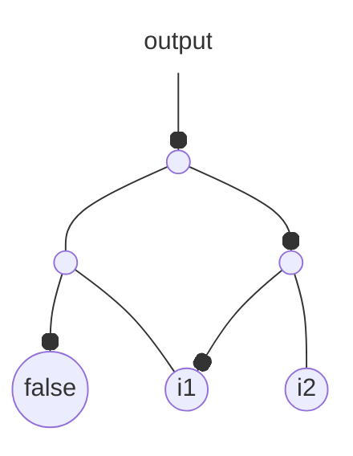
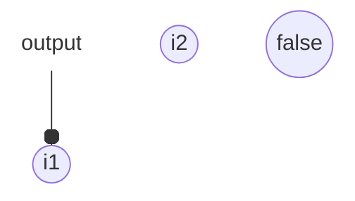
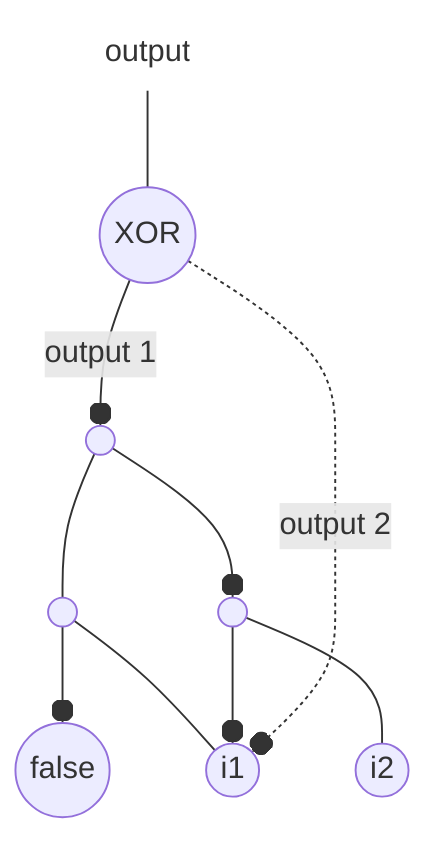

# MUTAIG: mutable AIG

A library for manipulating And-Inverter Graphs (AIGs), designed for combinational equivalence checking.

## Installation

As for any other Rust library:

```shell
cargo add mutaig
```

## Getting started

### Creating your first AIG

Let's create the following AIG (nodes are representing `AND` gates, and black dots on the edges are inverters ie `NOT` gates):



It represents the boolean function $f(i1, i2) = \neg[(\text{true} \land i1) \land \neg(\neg i1 \land i2)]$.

It can be created manually as follows:

```rust
use mutaig::{Aig, AigEdge, AigNode};

let mut aig = Aig::new();
let node_false = aig.add_node(AigNode::False).unwrap();
let i1 = aig.add_node(AigNode::Input(1)).unwrap();
let i2 = aig.add_node(AigNode::Input(2)).unwrap();
let a3 = aig
    .add_node(AigNode::And {
        id: 3,
        fanin0: AigEdge::new(node_false.clone(), true),
        fanin1: AigEdge::new(i1.clone(), false),
    })
    .unwrap();
let a4 = aig
    .add_node(AigNode::And {
        id: 4,
        fanin0: AigEdge::new(i1.clone(), true),
        fanin1: AigEdge::new(i2.clone(), false),
    })
    .unwrap();
let a5 = aig
    .add_node(AigNode::And {
        id: 5,
        fanin0: AigEdge::new(a3.clone(), false),
        fanin1: AigEdge::new(a4.clone(), true),
    })
    .unwrap();

aig.add_output(5, true).unwrap();
aig.update();
```

In practice, you will probably never have to build an AIG by hand. Instead, you can use the `Aig::from_file` function:

```rust
use std::path::Path;
use mutaig::Aig;

let mut aig = Aig::from_file("myfile.aag").unwrap();
```

with `myfile.aag` in the AIGER format (here ASCII) corresponding to the AIG above:

```
aag 5 2 0 1 2
2
4
7
6 8 11
8 1 2
10 3 4
```

Note that the `Aig::from_file` function also supports `.aig` files, which is the binary [AIGER](https://fmv.jku.at/aiger/) format.

### Proving your first functional equivalence

Let's consider the boolean function above once again, and let's simplify it by applying De Morgan's law:

$$
\begin{align*}
f(i1, i2) &= \neg[(\text{true} \land i1) \land \neg(\neg i1 \land i2)] \\
&= \neg [i1 \land (i1 \lor \neg i2)] \\
&= \neg i1 \lor \neg (i1 \lor \neg i2) \\
&= \neg i1 \lor (\neg i1 \land i2) \\
&= \neg i1
\end{align*}
$$

It can be represented by the simpler AIG:



This will encoded as follows in `optimized.aag`:

```
aag 1 1 0 1 0
2
3
```

To prove the two AIGs are indeed equivalent, let's create the following miter (reference is using straight lines, optimized uses dotted lines):



If the output of the miter is one, the AIGs are different (their outputs differ for the same set of inputs). To prove they are equivalent, let's prove the output of the miter can never be true.

To do that, let's assume it is true. Then generate some SAT clauses using [Tseytin transformation](https://en.wikipedia.org/wiki/Tseytin_transformation), and give the obtained CNF to a SAT solver:

- if the CNF is UNSAT, then AIGs are proven equivalent
- else if the CNF is SAT, the AIGs are functionally differ (there exists a set of inputs such that the two AIGs return two different results).

In terms of Rust code:

```rust
use std::collections::HashMap;
use mutaig::{Aig, miter::Miter};

let reference = Aig::from_file("myfile.aag").unwrap();
let optimized = Aig::from_file("optimized.aag").unwrap();

// In general, an AIG might have multiple outputs.
// So we need to tell the miter which outputs of the reference
// correspond to which outputs of the optimized version.
let output_a = reference.get_outputs()[0];
let id_a = output_a.get_node().borrow().get_id();
let output_b = optimized.get_outputs()[0];
let id_b = output_b.get_node().borrow().get_id();
let outputs_mapping = HashMap::new();
outputs_mapping.insert((id_a, output_a.get_complement()), (id_b, output_b.get_complement()));

let mut miter = Miter::new(&reference, &optimized, outputs_mapping).unwrap();
let cnf = miter.extract_cnf().unwrap();

// Here you can give the CNF to any SAT solver
// You can use the dimacs format:
let dimacs = cnf.to_dimacs();

// If the CNF is UNSAT, AIGs have been proved equivalent using Tseytin transformation and a SAT solver!
```

### Proving functional equivalence of internal nodes

When AIGs are too large, the extracted CNF is too large for SAT solvers. Note that modern SAT solvers are incredibly efficient (for example [kissat](https://github.com/arminbiere/kissat) was able to prove a CNF with 50 million of clauses UNSAT in less than 10s). But still, this doesn't scale for very large circuits.

You should look at three very helpful functions:

- `mergeable`: to check if nodes are obviously functionally equivalent
- `extract_cnf_node`: to extract a miter+CNF between two internal nodes
- `merge`: to merge two nodes that you have proven equivalent (using `mergeable` or `extract_cnf_node`)

## Docs

The docs for the latest release of MUTAIG are available on [docs.rs](https://docs.rs/mutaig/latest/mutaig/).

Alternatively, if you want the latest version of the docs, you can compile them from source with:

```shell
cargo doc
```

---

Inspired by [aig-rs](https://github.com/gipsyh/aig-rs).

# TODO

- miter tests
- parser bin tests
- more tests
- more docs
