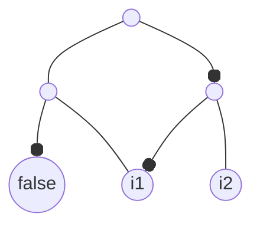

# MUTAIG: mutable AIG

A library for manipulating And-Inverter Graphs (AIGs), designed for equivalence checking.

## Installation

As for any other Rust library:

```shell
cargo add mutaig
```

## Getting started

Let's create the following AIG:



It represents the boolean function $f(i1, i2) = (\text{true} \land i1) \land \neg(\neg i1 \land i2)$.

```rust
use mutaig::{Aig, AigEdge, AigNode};

let mut aig = Aig::new();
let node_false = aig.add_node(AigNode::False).unwrap();
let i1 = aig.add_node(AigNode::Input(1)).unwrap();
let i2 = aig.add_node(AigNode::Input(2)).unwrap();
let a3 = aig
    .add_node(AigNode::And {
        id: 3,
        fanin0: AigEdge::new(node_false.clone(), true),
        fanin1: AigEdge::new(i1.clone(), false),
    })
    .unwrap();
let a4 = aig
    .add_node(AigNode::And {
        id: 4,
        fanin0: AigEdge::new(i1.clone(), true),
        fanin1: AigEdge::new(i2.clone(), false),
    })
    .unwrap();
let a5 = aig
    .add_node(AigNode::And {
        id: 5,
        fanin0: AigEdge::new(a3.clone(), false),
        fanin1: AigEdge::new(a4.clone(), true),
    })
    .unwrap();

aig.add_output(5).unwrap();
aig.update();
```

## Docs

The docs for the latest release of MUTAIG are available on [docs.rs](https://docs.rs/mutaig/latest/mutaig/).

Alternatively, if you want the latest version of the docs, you can compile them from source with:

```shell
cargo doc
```

---

Inspired by [aig-rs](https://github.com/gipsyh/aig-rs).

# TODO

- miter tests
- miter integration with a sat solver
- integrity checks
- support latches
- support creation from a parser/aiger
- more tests
- more docs
- getting started

- add output only with the id? or with the node directly
